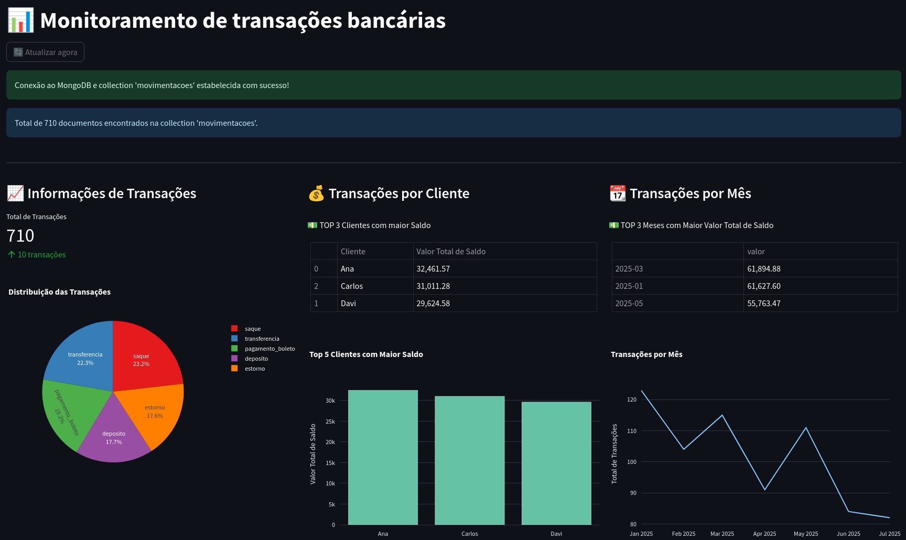
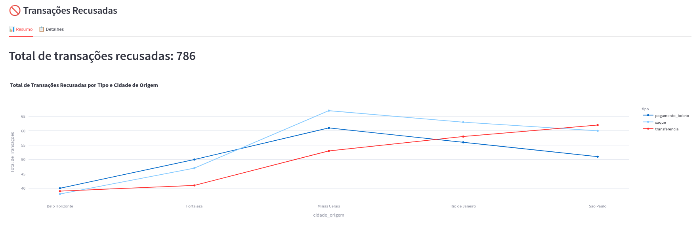
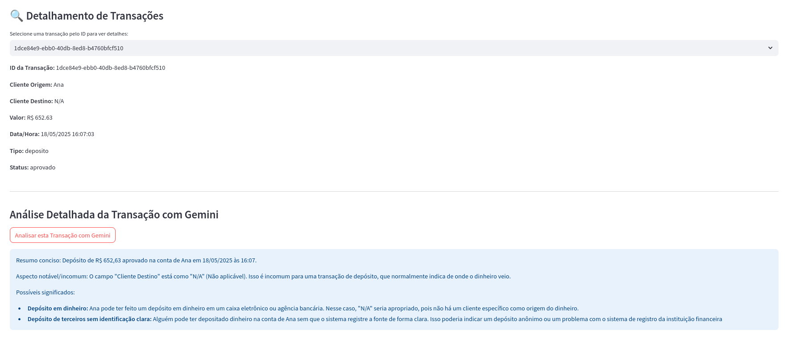
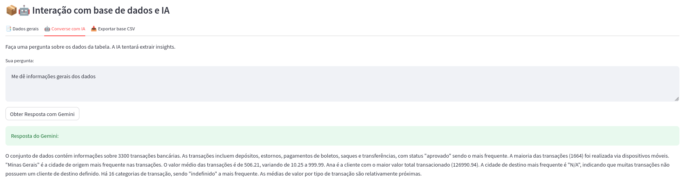

# 🚀 Projeto de Simulação de Atividades Bancárias com Kafka, MongoDB e Streamlit

Este projeto simula um pipeline de dados de atividades bancárias usando **Apache Kafka** para transmissão de mensagens, **MongoDB** para armazenamento e **Streamlit** para visualização e análise em tempo real.

---

## 🌟 Visão Geral

O objetivo principal é demonstrar um fluxo de dados em tempo real:

1. **Geração de Dados Fictícios:** Um `Producer` gera transações bancárias simuladas (depósitos, saques, transferências) com lógica de saldo.
2. **Streaming de Mensagens:** As transações são enviadas para um tópico Kafka.
3. **Consumo e Persistência:** Um `Consumer` lê as mensagens do Kafka e as persiste em um banco de dados MongoDB.
4. **Visualização Analítica:** O Streamlit se conecta ao MongoDB para exibir informações analíticas e insights sobre as movimentações bancárias, incluindo uma camada de inteligência artificial com a **API Google Gemini** para perguntas abertas e análise contextual dos dados.

---

## 🛠️ Tecnologias Utilizadas

* **Apache Kafka:** Plataforma de streaming de eventos distribuída.
* **MongoDB:** Banco de dados NoSQL para armazenamento das transações.
* **Streamlit:** Framework Python para construção rápida de aplicações web interativas e dashboards.
* **Google Gemini API:** Modelo de linguagem de grande escala (LLM) para análise conversacional e extração de insights dos dados, integrado ao Streamlit.
* **Python:** Linguagem de programação principal.
* **Docker & Docker Compose:** Para orquestração e execução dos serviços (Kafka, Zookeeper, MongoDB).

---

## 🔑 Configuração da Google Gemini API

Para utilizar a funcionalidade de "Perguntas com IA" e outras análises do Gemini, você precisará configurar sua chave de API:

1.  **Obtenha uma Chave de API:** Acesse o [Google AI Studio](https://aistudio.google.com/app/apikey) ou o [Console do Google Cloud](https://console.cloud.google.com/apis/credentials) para gerar sua chave de API para o Gemini.

2.  **Crie um arquivo `.env`:** Na raiz do projeto, crie um arquivo chamado `.env` (se já não existir) e adicione sua chave de API no seguinte formato:

    ```
    GENAI_API_KEY="SUA_CHAVE_DE_API_AQUI"
    ```

    Substitua `"SUA_CHAVE_DE_API_AQUI"` pela chave que você obteve.

    **Importante:** Nunca compartilhe sua chave de API publicamente nem a inclua diretamente no código-fonte ou em repositórios públicos. O arquivo `.env` é lido localmente e não deve ser versionado (verifique se `*.env` está no seu `.gitignore`).

---

## 📂 Estrutura do Projeto

```
.
├── docker-compose.yml              # Definição dos serviços Docker (Kafka, Zookeeper, MongoDB)
├── Dockerfile                      # Arquivo para criação da imagem Docker do projeto
├── poetry.lock                     # Bloqueio das dependências do Poetry
├── pyproject.toml                  # Dependências do projeto (utiliza o Poetry)
├── README.md                       # Este arquivo
├── requirements.txt                # Dependências Python (caso não use o Poetry)
└── src/
    ├── dashboard_streamlit.py      # Aplicação Streamlit para visualização das transações
    ├── kafka_consumer.py           # Script para consumir dados do Kafka e persistir no MongoDB
    ├── kafka_producer.py           # Script para gerar e enviar dados para o Kafka
    ├── main.py                     # Script principal que executa o producer, consumer e Streamlit
    ├── mongodb_connect.py          # Módulo para conexão e operações no MongoDB
    └── test
        ├── test_producer.py        # Script para testar a função que gera dados para o Kafka
        └── verifica_dados_mongo.py # Script para testar e verificar dados no MongoDB
```
---

## 📊 Visualização no Streamlit

O aplicativo Streamlit (`dashboard_streamlit.py`) se conecta ao MongoDB e fornece um dashboard interativo onde você poderá:

* Ver as últimas transações.
* Visualizar estatísticas agregadas (total de depósitos, saques, etc.).
* Analisar o saldo dos clientes (se implementado no Streamlit).
* Observar o fluxo de dados em tempo real.
* Utilizar uma nova aba de "Perguntas com IA" para obter insights e resumos dos dados através da API Google Gemini, permitindo consultas em linguagem natural sobre o comportamento das transações.
* Receber projeções preditivas e análises detalhadas de transações específicas, potencializadas pelo raciocínio do Gemini.

---

## 🖼️ Dashboard Streamlit

Aqui estão capturas de telas do dashboard Streamlit:






---

## 🚀 Como Rodar o Projeto

### 1. Clonar o repositório

```bash
git clone https://github.com/felipealvss/kafka_randomfaker.git
cd kafka_randomfaker
```

### 2. Configurar o Ambiente

Recomenda-se usar o **Poetry** para gerenciar as dependências do projeto:

```bash
poetry install
```

Alternativamente, se preferir usar o `pip`, instale as dependências listadas no `requirements.txt`:

```bash
pip install -r requirements.txt
```

### 3. Subir os Serviços com Docker Compose

Este projeto utiliza Docker e Docker Compose para orquestrar os serviços. Execute o seguinte comando para iniciar o Kafka, Zookeeper e o MongoDB:

```bash
docker-compose up -d
```

Isso irá subir os containers com as configurações predefinidas.

### 4. Executar o Projeto

O arquivo `src/main.py` é o ponto de entrada do projeto. Ele inicia simultaneamente os seguintes componentes:

* O **Kafka Producer** (que gera e envia dados para o Kafka),
* O **Kafka Consumer** (que consome as mensagens e as envia para o MongoDB),
* A aplicação **Streamlit** (que exibe o dashboard interativo).

Para executar o fluxo completo, basta rodar o script `main.py`:

```bash
python src/main.py
```

O script irá iniciar os três processos em paralelo.

### 5. Acessar o Dashboard Streamlit

Após iniciar o projeto com o comando acima, você poderá acessar o dashboard no navegador através do endereço:

```bash
http://localhost:8501
```

---

## 🧪 Testes

Os testes podem ser executados com o framework de testes de sua escolha. Um exemplo de teste já está implementado no arquivo `src/test/verifica_dados_mongo.py`, que verifica a persistência dos dados no MongoDB.

Para rodar os testes, você pode usar 2 estratégias:

* Utilizar o `pytest`:

```bash
PYTHONPATH=src poetry run pytest
```

* Executar a consulta direta via `python`:

```bash
poetry run python tests/verifica_dados_mongo.py
```

---

## Equipe de projeto:

- [Felipe Alves da Silva](https://github.com/felipealvss) (Matrícula: 2329032)
- [Benício Bezerra de Abreu Carneiro](https://github.com/becarneiro) (Matrícula: 2419566-0)

---